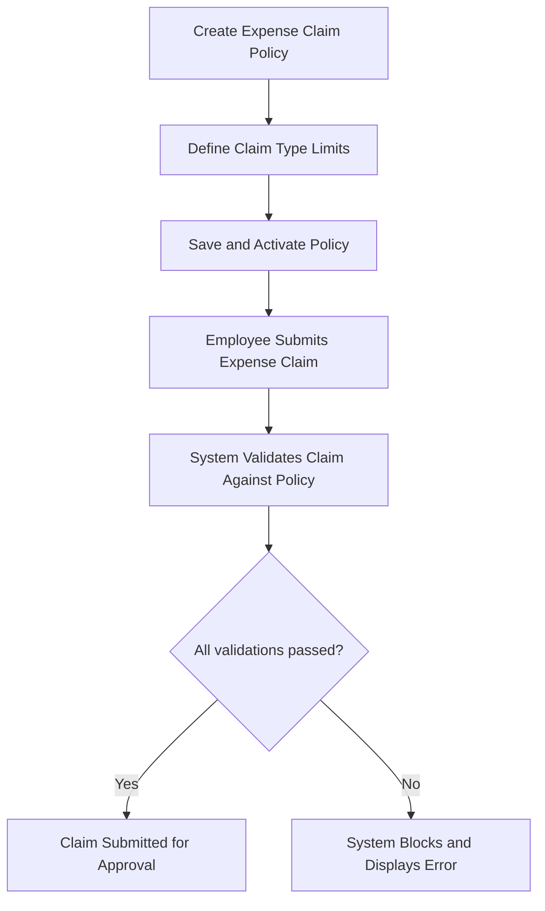

# Expense Claim Policy

## Overview

The Expense Claim Policy module defines the reimbursement rules and restrictions for employees based on their **Employee Grade**.
Each policy specifies claim limits, mandatory fields, and validation rules to ensure all expense claims are compliant with company policy.

## 🎯 Purpose

- Create expense claim rules and limits by Employee Grade.
- Define maximum and minimum claim amounts per expense type.
- Enforce mandatory attachments and validation rules.
- Automatically validate submitted expense claims against the assigned employee policy.

## How It Works

### Step 1: Create Expense Claim Policy

Navigate to:
**Human Resources → Expense Claim Management → Expense Claim Policy**

Click **New**.

Enter the following fields:

| Field | Description |
|-------|-------------|
| **Name** | Unique name or title for the policy (e.g., "Expense-Policy – Non-Exec") |
| **Employee Grade** | Select the employee grade (e.g., Non-Exec, Executive, Manager) |
| **Status** | Determines if the policy is active or inactive (only active policies are applied) |

### Step 2: Define Allowance Categories

Each policy can have multiple allowance categories — typically grouped as follows:

#### Meal Allowance

Used to define meal-related claim limits.

| Field | Description |
|-------|-------------|
| **Claim Type** | Select the claim type (e.g., Breakfast, Lunch, Dinner) |
| **Max Amount** | Maximum claimable amount per submission or per day |
| **Min Amount** | Minimum amount required for claim eligibility |
| **Details** | Optional notes or description (e.g., per meal limit, claim frequency) |

#### Mileage

Used to define travel mileage claims.

| Field | Description |
|-------|-------------|
| **Claim Type** | Select the claim type (e.g., Fuel Allowance, KM Claim) |
| **Max Amount** | Maximum claimable limit per trip or per month |
| **Min Amount** | Minimum threshold before claim submission |
| **Details** | Optional notes or calculation method (e.g., rate per km) |

#### Accommodation

Used for lodging and stay-related expense limits.

| Field | Description |
|-------|-------------|
| **Claim Type** | Select claim type (e.g., Hotel, Lodging) |
| **Max Amount** | Maximum claimable per night or trip |
| **Min Amount** | Minimum claimable amount (if applicable) |
| **Details** | Notes about eligibility or supporting conditions |

### Step 3: Save the Policy

After defining all categories:

- Click **Save** to store the policy.
- Once saved, the policy becomes active for all employees under the selected Employee Grade (if the status is "Active").

## Validation & Enforcement

When an employee submits an **Expense Claim**:

1. The system automatically checks their **Employee Grade**.
2. The **Expense Claim Policy** for that grade is applied.
3. Each claim line is validated against the corresponding **Claim Type** rule:
   - If claim amount exceeds **Max Amount**, submission is blocked.
   - If claim amount is below **Min Amount**, system prompts warning/error.
   - If required attachment is missing, submission is blocked.
   - If any mandatory field is not filled (e.g., expense date, justification), validation fails.

> **Note:** Validation ensures all claims comply with corporate policy before reaching the approver, reducing manual verification effort.

## Example Scenario

**Policy:** Expense-Policy – Non-Exec  
**Employee Grade:** Non-Exec  
**Allowance Limits:**
- Meal Allowance (Breakfast) → Max RM 15.00
- Mileage (Fuel) → Max RM 0.80/km
- Accommodation → Max RM 150.00/night

**Behavior:**

When an employee of grade **Non-Exec** submits an Expense Claim:
1. The system references **Expense-Policy – Non-Exec**.
2. Each claim type is validated against its configured limits.
3. If all validations pass, claim proceeds to approver.
4. If any rule is violated (e.g., missing receipt or amount over limit), the system blocks submission.

## Process Flow

## Notes and Best Practices

- Only one active policy should exist per **Employee Grade** to avoid conflicts.
- Always review claim types and limits periodically to match HR policies.
- Deactivate old or superseded policies instead of deleting.
- Keep documentation for each policy revision to ensure audit compliance.