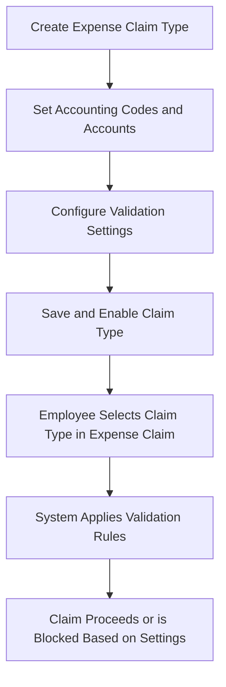

# Expense Claim Type

## Overview

The Expense Claim Type defines the individual claim categories available to employees when submitting an expense claim.
Each Expense Claim Type determines accounting details, validation rules, and operational behavior such as attachment requirements, date range limits, and expense sharing modes.

## 🎯 Purpose

- Define standardized expense claim categories (e.g., Parking, Mileage, Accommodation).
- Link each claim type to the appropriate account and cost center.
- Set specific validation rules such as:
  - Region allocation
  - Expense sharing
  - Allow duplicate claims
  - Date range requirement
  - Attachment requirement

## How It Works

### Step 1: Create Expense Claim Type

Navigate to:
**Human Resources → Expense Claim Management → Expense Claim Type**

Click **New**.

Enter the following details:

| Field | Description |
|-------|-------------|
| **Claim Type Name** | Name of the claim type (e.g., "Parking") |
| **Account Code** | Code representing the linked expense account |
| **Account Name** | Account name associated with this claim type |
| **JA3 Code / JA3 Name** | Optional analytical or sub-ledger reference codes (for internal mapping) |
| **Description** | Additional notes or clarification on claim purpose |
| **Expense Template** | Predefined template for this claim type (optional) |

### Step 2: Define Company-Specific Accounts

Each Expense Claim Type can have multiple company-specific account mappings to ensure correct posting across entities.

| Field | Description |
|-------|-------------|
| **Company** | Select the company to which the mapping applies |
| **Default Account** | Select the GL account used when this claim type is chosen for that company |

**Example:**
- Fortune Bit Solutions → Travel Expenses - F
- Tektician Sdn Bhd → Travel Expenses - TSB
- Arcadia Blossom → Travel Expenses - A

### Step 3: Configure Settings & Validations

On the right-side Settings panel, you can enable or disable key validation features:

| Setting | Description |
|---------|-------------|
| **Attachment Required** | Forces users to attach supporting documents (e.g., receipts, toll slips) |
| **Data Range** | Enables date-based validation for expenses (e.g., only within a certain range) |
| **Expense Sharing** | Allows claim cost splitting between departments, projects, or regions |
| **Region Claimable** | Restricts claims to predefined regions (e.g., HQ, Northern Region) |
| **Region Allocation** | Allows the system to assign region data automatically for reporting |
| **Duplicate Allowed** | Permits the same expense to be claimed more than once (for recurring claims) |
| **Invoice Number** | Requires the user to input invoice number for traceability |

## Validation Behavior

When an Expense Claim is submitted:

1. The system checks the selected **Expense Claim Type** configuration.
2. Validations are applied based on the claim type's enabled settings:
   - If **Attachment Required**, claim cannot be submitted without a file.
   - If **Duplicate Allowed** is disabled, the system blocks duplicate entries for the same expense.
   - If **Data Range** is enabled, the claim date must fall within the allowed range.
   - If **Region Claimable** is set, the claim must match the assigned region.

## Example Scenario

**Claim Type:** Parking  
**Account Code:** 9102/009  
**Account Name:** Staff Allowance  
**JA3 Code:** SA004  
**JA3 Name:** Parking & Toll  
**Attachment Required:** ✔️  
**Duplicate Allowed:** ❌  

**Linked Accounts:**
- Fortune Bit Solutions → Travel Expenses - F
- Tektician Sdn Bhd → Travel Expenses - TSB

**Behavior:**
- Employees must upload a receipt for each Parking claim.
- System prevents claiming the same parking receipt twice.
- Expense is posted to the corresponding company's default travel expense account.

## Process Flow

## Notes and Best Practices

- Keep **Claim Type Names** standardized to avoid confusion across companies.
- Always define **Default Account** for every company to prevent posting errors.
- Use **Attachment Required** and **Data Range** to maintain audit trail integrity.
- Disable **Duplicate Allowed** unless there's a valid business need.
- Review claim types periodically to align with accounting policies.