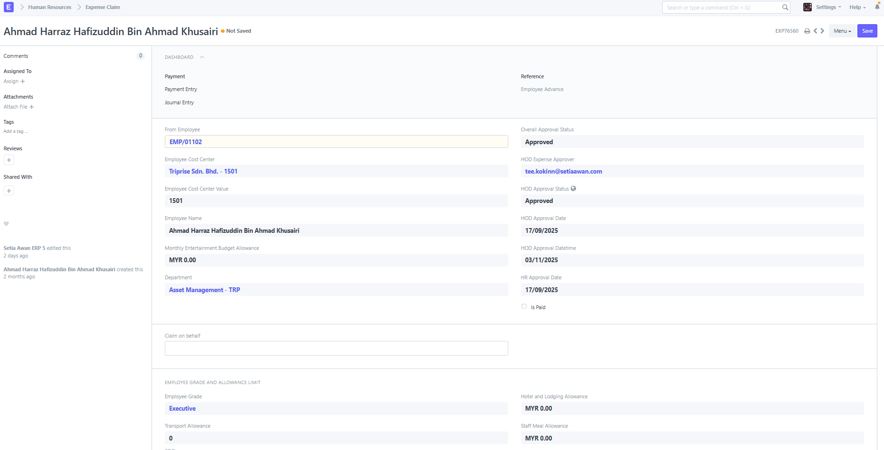
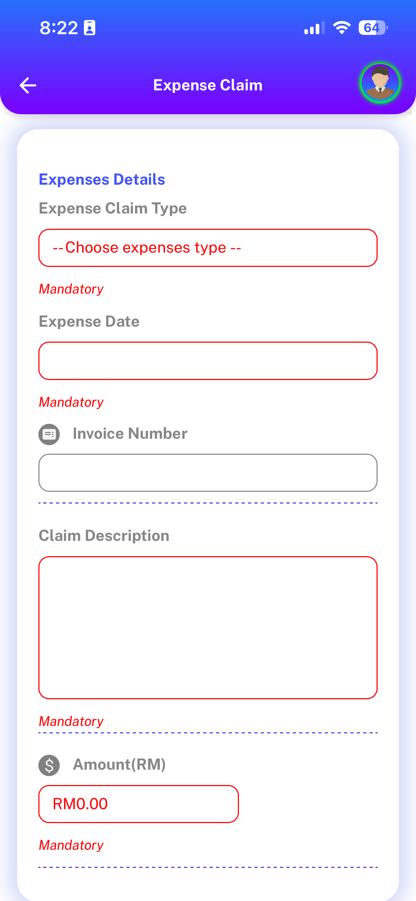
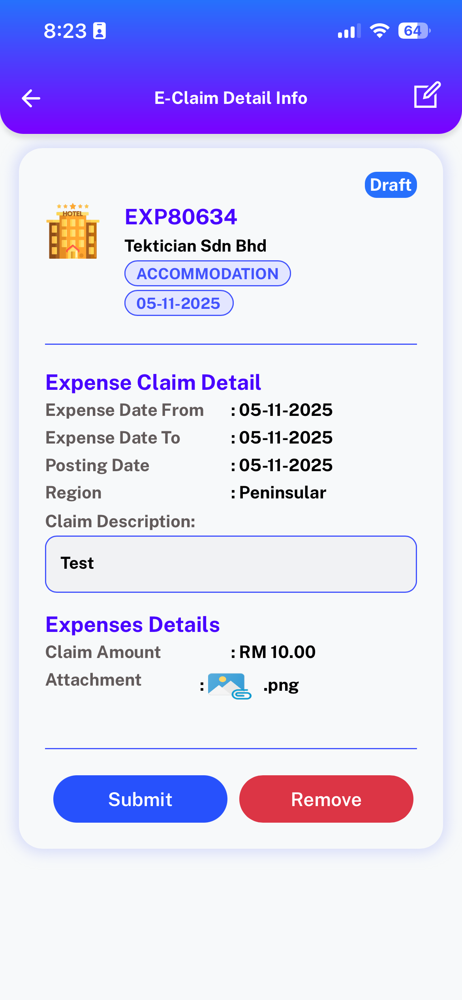
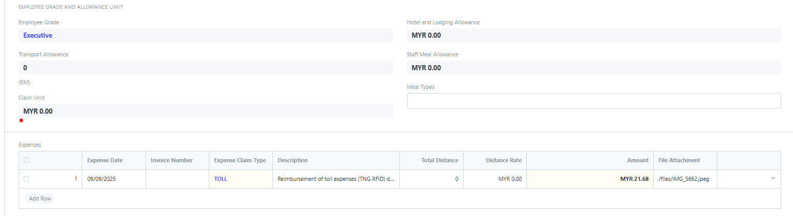

# Expense Claim

**Expense Claim is made when employees make expenses out of their pocket on behalf of the company.**

For example, if they take a customer out for lunch, they can make a request for reimbursement via the Expense Claim form.

To access an Expense Claim, go to:

> Human Resources \> Expense Claims \> Expense Claim

## 1. How to create a Expense Claim

1.  Go to: Expense Claim \> New.
2.  Select the Employee Name in the 'From Employee' field.
3.  Select the Expense Approver.
4.  Enter the Expense Date, Expense Claim Type and the Amount.
6.  Save and Submit.

Set the Employee ID, date, the list of expenses, and corresponding taxes that are to be claimed and “Submit” the record.

The expense claim limit and allowance will auto populate based on the configuration set ERPNext during setup. If this configuration needs to be changed please contact your administrators to change this limits.

## Expense claim workflow

### Approving Expenses (Three Stage Approval)

Approver for the Expense Claim is derived from [Employee]() master's `Reports To` field.

After saving and submitting Expense Claim the status(workflow state) will be changed to Pending HOD Approval. Approver(HOD) of the Employee will receive a notification on Staffhub/Email to prompt for further action.

On Approval of Expense Claim, the status(workflow state) will be changed to Approved. If the [Employee]() master have "Expense Require Director Approval", the Expense Claim is then progressed into "Pending DIR Approval".