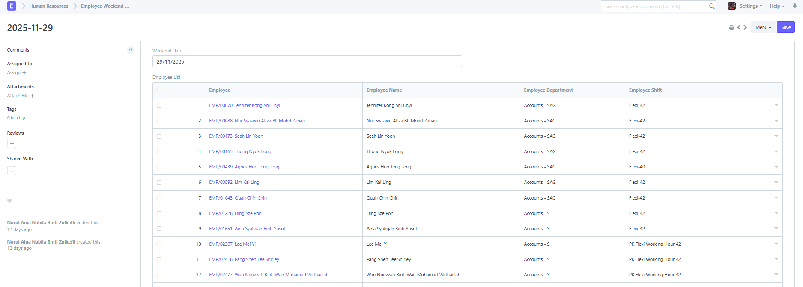
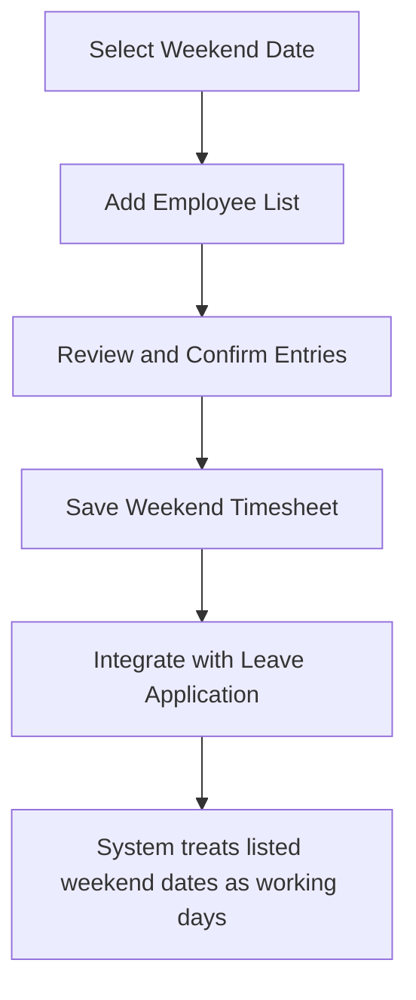

# Employee Weekend Timesheet

## Overview

The Employee Weekend Timesheet module is designed to manage and track employees scheduled to work on weekends. It provides a centralized list of staff assigned for weekend duties and ensures that when these employees apply for leave, the system correctly treats those weekend days as working days for calculation purposes.

## 🎯 Purpose

- Maintain a list of employees required to work on weekends.
- Automatically align with Leave Application logic, allowing the system to recognize those specific weekend dates as working days for the selected employees.
- Improve accuracy in payroll, attendance, and leave calculations.

## How It Works

### 1. Weekend Date Selection

The user begins by selecting a **Weekend Date**. This date represents the specific weekend (Saturday/Sunday or custom rest day) that employees will be assigned to work.

**Example:** Selecting `29/11/2025` will create a weekend timesheet record for that date.

### 2. Employee List

After choosing the weekend date, the user adds employees to the **Employee List** table. Each row captures essential employee details:

| Field | Description |
|-------|-------------|
| **Employee** | Employee ID with name reference (e.g., `EMP/00070: Jennifer Kong Shi Chyi`) |
| **Employee Name** | Auto-filled from the Employee master |
| **Employee Department** | Department assigned to the employee |
| **Employee Shift** | The specific working shift (e.g., `Flexi-42`, `PK Flexi Working Hour 42`) |

The list supports multi-department employees and different shift configurations.

### 3. Save the Record

Once the list is finalized:
- Click **Save** to record the entry.
- The document will be available for reference in future leave or timesheet calculations.
- The data can also be used by HR and Attendance modules for reporting or validations.

## Process Flow

## Integration with Leave Application

When an employee who appears in a Weekend Timesheet applies for leave:
- The system checks if the leave date matches any listed weekend dates.
- If a match is found, the leave day is treated as a **working day** rather than a non-working weekend.
- This ensures:
  - Correct leave deduction
  - Accurate attendance reporting
  - Proper payroll computation

## Example Scenario

1. **Weekend Timesheet Date:** 29/11/2025
2. **Employee Included:** `EMP/00088 - Nur Syazwin Atiza Bt. Mohd Zahari`
3. **Leave Applied:** 29/11/2025 (Saturday)
4. **System Action:** The leave day is treated as working and deducted accordingly.

## Notes & Best Practices

- HR/Admin users should update the Weekend Timesheet regularly before each weekend rotation.
- The list can include multiple departments.
- Always verify employee shifts before saving, as it impacts working hour calculation.
- Avoid duplicate entries for the same employee on the same date.