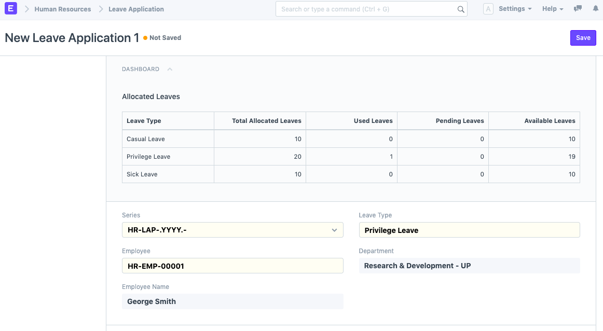
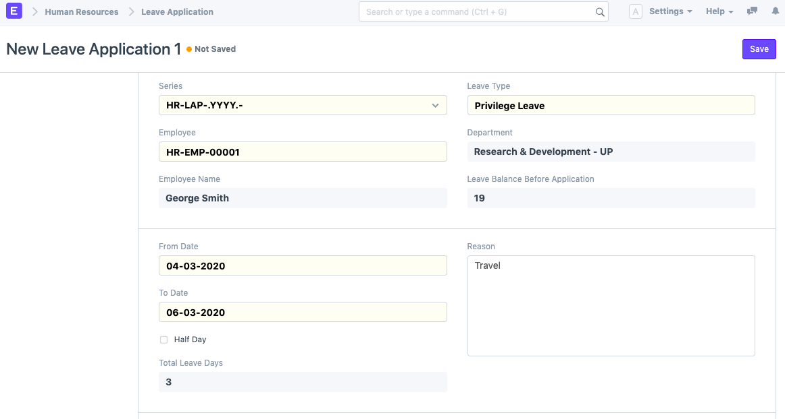
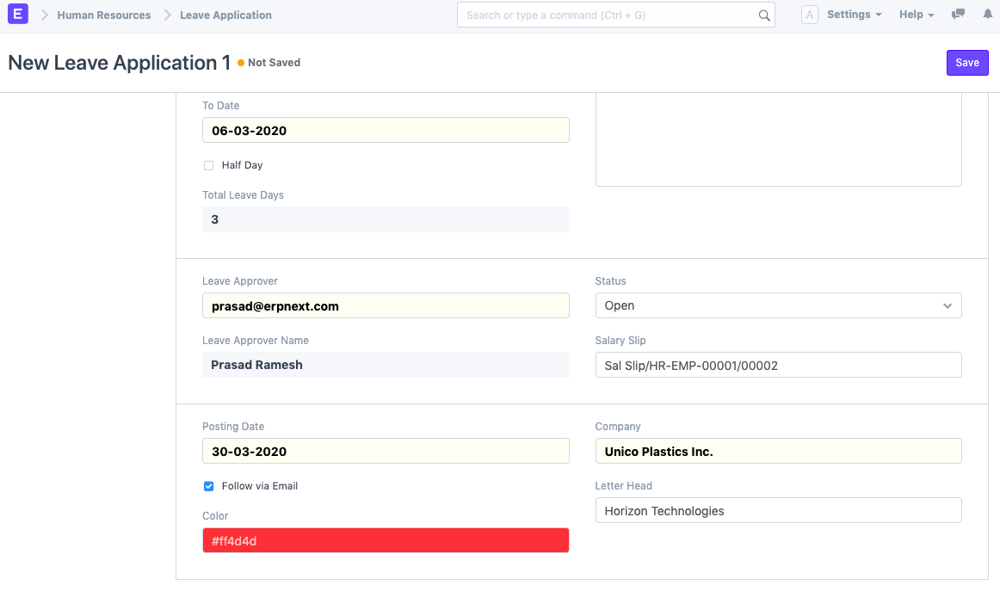
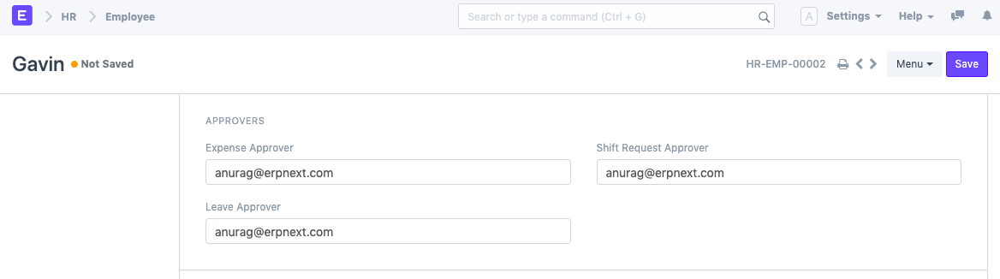

# Leave Application

**Leave Application is a formal document created by an Employee to apply for Leaves for a particular time period.**

ERPNext allows your employees to apply for leaves via Leave Applications and get them approved by the Leave Approvers.

To access Leave Application, go to:

> Home \> Human Resources \> Leaves \> Leave Application

## 1. Prerequisites

Before you create a Leave Application, it is advisable you have the following documents:

1.  [Department]()
2.  [Leave Period]()
3.  [Holiday List]()
4.  [Leave Type]()
5.  [Leave Policy]()
6.  [Leave Allocation]()

## 2. How to create a Leave Application

1.  Go to Leave Application list, click on New.
2.  A table of Allocated Leaves will be shown. Based on the Leaves taken, the available leaves are displayed for each Leave Type.
3.  
4.  Select the Employee Name and Leave Type.
5.  Set the Leave duration using From Date and To Date. Based on the dates selected, the 'Total Leave Days' and the 'Leave Balance Before Application' fields will be displayed.
6.  If the Leave applied is for a half-day, select the 'Half Day' checkbox.
7.  Enter the Reason for Leave.
8.  
9.  Select Leave Approver.
10. Select the Posting Date of the Leave Application.
11. Check the 'Follow via Email' checkbox to send notification of the Leave Application to the Leave Approver.
12. You can also link the Salary Slip of the Employee in the Leave Application for the record.
13. 
14. Click on Save. Once the Employee saves the Leave Application, the status of the Leave Application changes to 'Open', and an email is sent to the Leave Approver for approval.
15. Once the Leave Approver receives the email, they can Approve, Reject, or Cancel the Leave Application. Once this is done, the Leave Approver can submit the Leave Application. On submission, the status of the document changes accordingly, and an email is sent to the Employee notifying them the same.

\_Note: Leave Application cannot be submitted if the Salary is already processed for the leave period.\_

The Leave Application process flow is summarized below:

1.  The employee applies for leave through Leave Application.
2.  Approver gets notification via email. For this, the "Follow via Email" checkbox should be checked.
3.  Approver reviews Leave Application.
4.  Approver approves/rejects/cancels Leave Application
5.  The employee gets the notification on the status of his/her Leave Application

## 3. Features

### 3.1 Setting Leave Approver

A leave approver is a user who can approve a Leave Application of an Employee.

1.  **Employee Level:** Leave Approvers can also be set Employee-wise in the employee master.
2.  

When a new Leave Application is created, if the selected leave approver does not have access to it, the document is shared with the approver with "submit" permission.

> **Additional Notes:**

1.  Leave Application period must be within a single Leave Allocation period. In case, you are applying for leave across the leave allocation period, you have to create two Leave Application records.
2.  Leave Application period must be in the latest Leave Allocation period.
3.  Employee cannot apply for leave on the dates which are added in the [Leave Block List](https://docs.frappe.io/erpnext/v13/user/manual/en/human-resources/leave-block-list).
