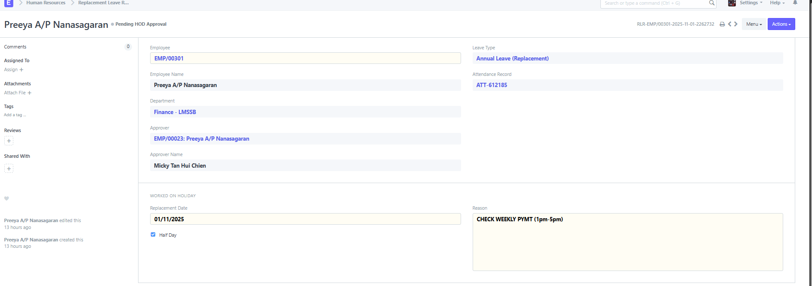

# Replacement Leave Request

**Replacement Leave is a leave that is granted to an Employee as compensation for working overtime or on holidays.**

ERPNext allows Employees to request for Replacement Leaves through the Replacement Leave Request document. It is necessary that the dates mentioned in the Replacement Leave Request should be in default Holiday List and also that the Employee should have their attendance marked Present.

> **Note:** Only Leave Types which are marked as 'Is Replacement' can be selected in the Replacement Leave Request.

To access Replacement Leave Request, go to:

> Home \> Human Resources \> Leaves \> Replacement Leave Request

## 1. Prerequisites

Before creating a Replacement Leave Request, it is necessary to create the following documents:

- [Employee]()
- [Leave Period]()
- [Leave Type]()
- [Leave Policy]()
- [Leave Allocation]()
- [Holiday List]()
- [Attendance]()

## 2. How to create a Replacement Leave Request

1.  Go to Replacement Leave Request list, click on New.

2.  Select the Employee ID. Once selected, The Employee Name and Department will get automatically fetched.

3.  Select Leave Type. (Annual Leave Replacement)

4.  Select Work From Date and Work End Date. This is the date of the day(s) the Employee has worked on, during a Holiday or Weekend.

5.  Enter the Reason.

6.  Save and Submit.

On submitting the Replacement Leave Request, ERPNext updates the Leave Allocation record for the Replacement leave type, allowing the Employee to apply for leaves of this type later on depending upon the number of leaves left.
